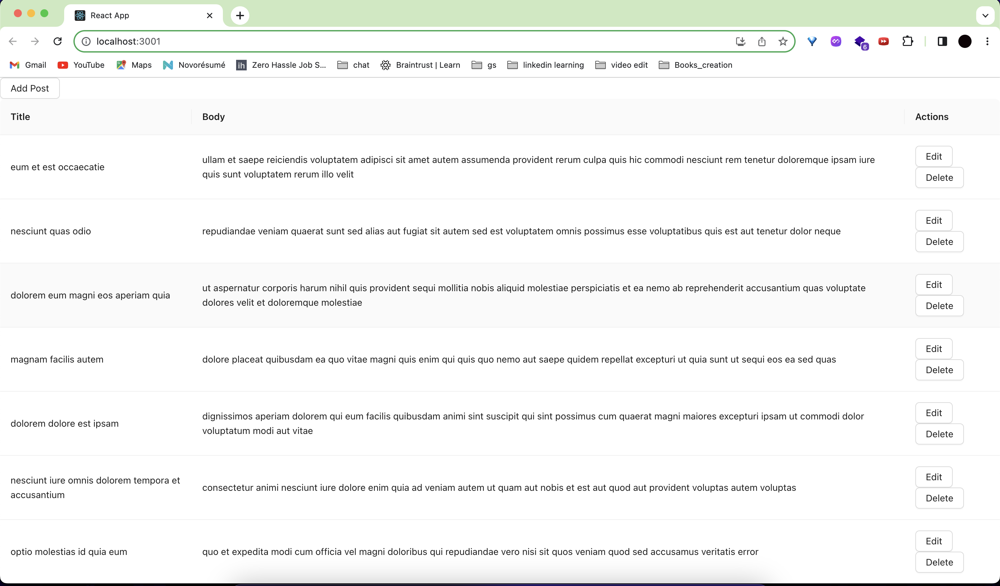
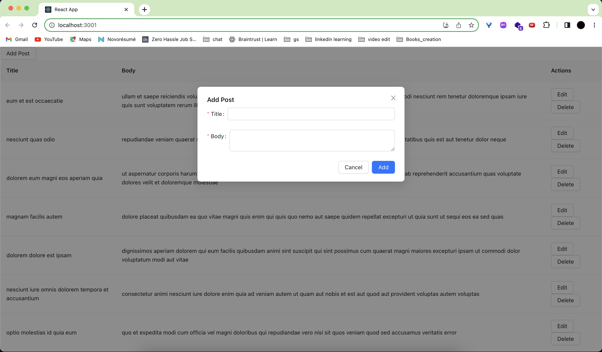
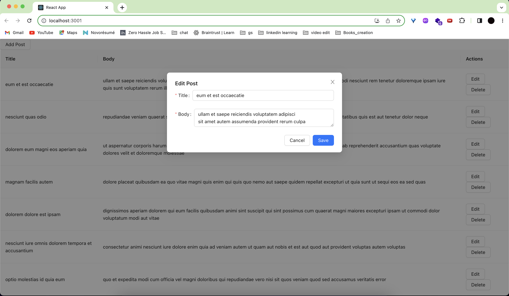

# CRUD Application with React and Node.js

This is a simple CRUD (Create, Read, Update, Delete) application built using React on the frontend and Node.js on the backend. The application allows users to manage posts by performing CRUD operations on a JSON file.

## Features

- View a table of posts with title and body information
- Add new posts
- Edit existing posts
- Delete posts

## Technologies Used

- React
- Node.js
- Express.js
- Ant Design
- JSONPlaceholder (Fake API)
- fs (File System) module

## Getting Started

### Prerequisites

- Node.js (version 12 or higher)
- npm (Node Package Manager)

### Screenshots





### Installation

1. Clone the repository:

   ```bash
   git clone <repository-url>
   ```

2. Navigate to the project directory:

`cd grabon-assignment`

3. Install the dependencies for the backend:

```

cd backend
npm install

```

4. Install the dependencies for the frontend:

```

cd frontend
npm install

```

## Run the project

1. Start the backend server:

```

cd backend
npm start

```

This will start the backend server at http://localhost:3002. by default

2. Start the React app:

```

cd frontend
npm start

```

This will start the frontend React app at http://localhost:3000. by default

- Open your browser and visit http://localhost:3000 to access the application.

## API Routes

1. `GET /api/v1/posts`: Retrieve all posts.
2. `POST /api/v1/posts`: Create a new post.
3. `PUT /api/v1/posts/:id`: Update a post by ID.
4. `DELETE /api/v1/posts/:id`: Delete a post by ID.
